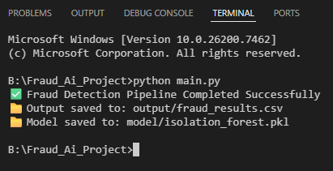

# 🧠 AI-Based Public Fraud & Anomaly Detection System

An end-to-end **AI-powered fraud detection platform** that ingests public financial transaction data, detects anomalous spending patterns using unsupervised machine learning, and visualizes risks through an interactive dashboard.

Built for **governance, audit, and policy decision support**.

---

## 📌 Problem Statement

Government and public financial systems generate massive volumes of transactions across departments.  
Manual audits are slow, reactive, and often miss hidden irregularities.

This project addresses the problem by:
- Unifying heterogeneous financial datasets
- Detecting anomalies using AI (without needing fraud labels)
- Providing transparent, explainable risk insights for human auditors

---

## 🚀 Features

- 🔄 Multi-source data ingestion (financial & government datasets)
- 🧠 Unsupervised fraud detection using Isolation Forest
- 📊 Risk scoring (Low / Medium / High)
- 🏛️ Department-wise and vendor-wise analysis
- 📈 Interactive Streamlit dashboard
- 👨‍⚖️ Human-in-the-loop, audit-friendly design

---

## 🗂️ Project File Structure

```
├── Fraud_Ai_Project/
│   ├── data/
│   │   ├── creditcard.csv
│   │   ├── fraud_train_preprocessed.csv
│   │   ├── paysim.csv
│   │   ├── receiver_general.csv
│   ├── model/
│   │   ├── isolation_forest.pkl    [auto generated]
│   ├── output/
│   │   ├── fraud_result.csv   [auto generated]
│   ├── main.py
│   ├── dashboard.py
```


---

## 🛠️ Tech Stack

- **Python 3**
- **Pandas / NumPy** – Data processing
- **Scikit-learn** – Machine Learning (Isolation Forest)
- **Streamlit** – Dashboard & UI
- **Plotly** – Interactive visualizations

---

## 📦 Installation & Setup

### 1️⃣ Clone the Repository
```
git clone https://github.com/your-username/fraud-ai-project.git
cd fraud-ai-project
```
```
python -m pip install pandas numpy scikit-learn joblib streamlit plotly
```

## ⚙️ Running the AI Pipeline

This step:

Loads datasets

Trains the AI model

Detects anomalies

Saves results and the trained model

python main.py

✔ Output Generated

output/fraud_results.csv → Fraud risk analysis

model/isolation_forest.pkl → Trained AI model


## 📊 Running 

Use the Terminal to Launch Main.py

```
python main.py
```

Launch the interactive dashboard using:
```
python -m streamlit run dashboard.py
```

Open your browser at:
```
http://localhost:8501
```

## 🧠 How the System Works

Step 1: Data Ingestion

Multiple financial datasets (banking, digital payments, procurement, accounting) are loaded.

Step 2: Data Normalization

All datasets are converted into a common government transaction schema:

transaction_id | department | vendor | amount | time | location

Step 3: Feature Engineering

The system derives fraud-related signals:

Vendor transaction frequency

Department-level average spending

Amount deviation from norms

Step 4: AI-Based Anomaly Detection

An Isolation Forest model learns normal transaction behavior and identifies rare or abnormal patterns.

No fraud labels required

Ideal for real-world government data

Step 5: Risk Scoring

Each transaction is assigned:

Low Risk

Medium Risk

High Risk

⚠️ The system does not auto-accuse fraud — it flags transactions for human audit review.

Step 6: Visualization

The Streamlit dashboard provides:

Risk distribution overview

Department-wise analysis

Vendor risk ranking

Interactive transaction drill-down

## 🧑‍⚖️ Ethics & Governance

✔ No automated punishment

✔ Transparent risk scoring

✔ Human-in-the-loop auditing

✔ Bias-aware, explainable AI

## 🎯 Use Cases

Government audit departments

Anti-corruption agencies

Public finance monitoring

Procurement oversight

Policy impact analysis


<p align="center">
  
</p>


